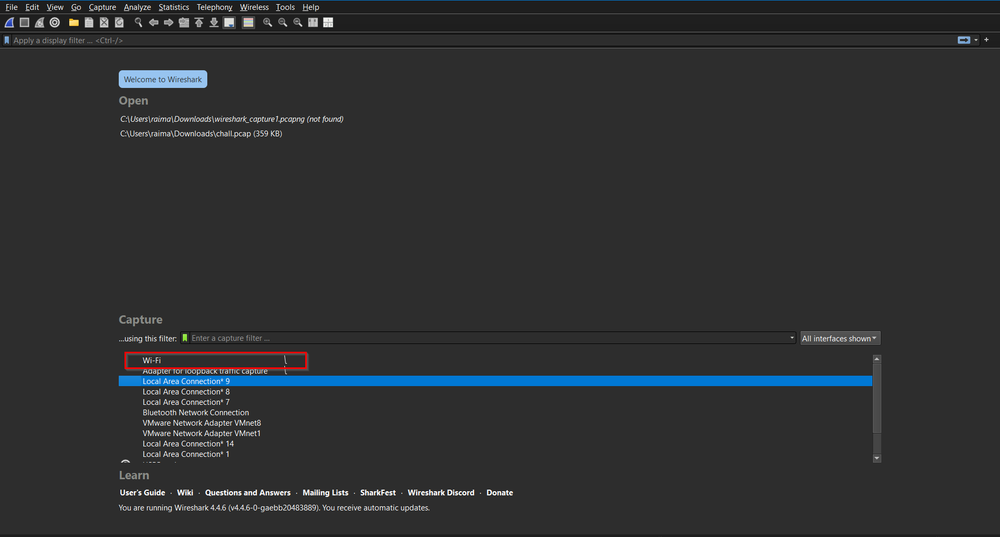
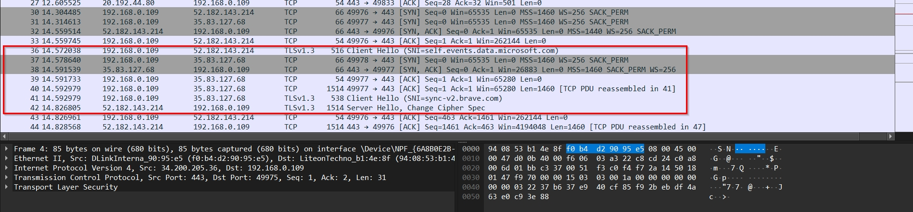

# **Network Packet Capture & Protocol Analysis Report**

**Name:** Mayank Rai

**Date:** 02.06.2025

**Tool Used:** Wireshark

**Filename:** `network_capture.pcap`

**Capture Duration:** ~[60 seconds]

**Network Interface:** [Wi-Fi]

---

##  **1. Setup & Traffic Generation**

###  1.1 Wireshark Setup

Briefly explain:

- Installed Wireshark.
- Selected network interface.
- Started capture.

*Wireshark interface showing the capture starting on a selected network interface.*

---

###  1.2 Traffic Simulation

Describe what you did to generate network activity:

- Opened browser and visited: [e.g., https://www.github.com]
- Ran a ping: `ping github.com`

*Command prompt showing the ping operation*

---

##  **2. Packet Capture Summary**

*Overview of captured packets.*

---

##  **3. Protocol Details and Screenshots**

---

###  **3.1 DNS (Domain Name System)**

- Purpose: Resolve domain names to IP addresses.
- Sample Packet: Query `www.dns.com`

*Packet details showing DNS Query and Response.*

---

### **3.2 ICMP (Ping)**

- Purpose: Used for diagnostic/troubleshooting.
- Observed: Echo Request + Reply (Type 8 and 0)

*ICMP Echo Request and Reply packets.*

---

### **3.4 TCP (Underlying Transport Layer)**

- Shows the 3-way handshake:
    - SYN
    - SYN-ACK
    - ACK

*TCP handshake sequence showing SYN, SYN-ACK, ACK.*

---

### **3.5 TLS (Secure HTTPS Traffic)**

- Purpose: Encrypted communication.
- Visible Packets: Client Hello, Server Hello

*TLS handshake showing client hello and server hello.*

🧾 *Notes:* Even though payload is encrypted, headers and cert details may be visible.

---

### **4. Exported Capture File**

- File saved as: `network_capture.pcap`
- Can be opened in Wireshark for validation.

---

##  **5. Conclusion**

- Successfully captured live traffic.
- Identified key protocols: DNS, ICMP, TCP, HTTP [+ TLS].
- Learned how to filter and inspect protocol-specific details.
- Observed how normal network activities leave protocol footprints.

---

##  Attachments

- `network_capture.pcap`
- Screenshots (in report or in folder)
